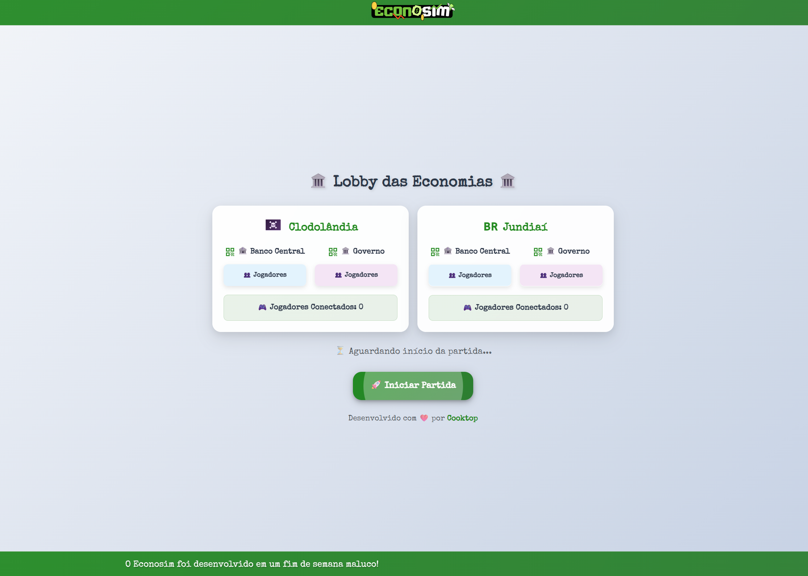

<p align="center">
  
</p>

<h1 align="center">📊 EconoSim — Simulador Interativo IS-LM</h1>

**EconoSim** é um jogo educacional interativo baseado no modelo macroeconômico **IS-LM**, desenvolvido para simular as decisões de política fiscal e monetária feitas por governos e bancos centrais em diferentes cenários econômicos.

O jogo foi criado para ser aplicado em salas de aula, como uma dinâmica prática que ajuda os alunos a entenderem as interações entre política econômica, PIB, taxa de juros e os choques externos.

---

## 🧠 Objetivo

Cada time representa uma entidade econômica: **Governo** ou **Banco Central**, de dois países diferentes. A cada rodada, os grupos discutem e tomam decisões que afetam variáveis econômicas como:

- Gastos Públicos (G)
- Oferta Monetária (M)
- Taxa de Juros (i)

Essas decisões influenciam a posição das curvas **IS** e **LM**, aproximando (ou afastando) o país de um equilíbrio macroeconômico ideal.

---

## 🖥️ Tecnologias Utilizadas

- **React** (frontend)
- **Socket.IO** (comunicação em tempo real)
- **Node.js** (backend)
- **Create React App** (build)
- **Styled with MUI** (layout e animações)

---

## 🚀 Rodando localmente

1. Clone o repositório:

```bash
git clone https://github.com/mercuryVM/econosim.git
cd econosim
```

2. Instale as dependências do servidor de cliente:

```bash
yarn
```

3. Inicie o servidor de cliente:

```bash
yarn start
```

4. Inicie o servidor Node JS
```bash
cd server
yarn
node index.js
```

4. Acesse no navegador:

### Cliente
```
http://localhost:3000
```

### Servidor
```
http://localhost:3000/server
```

---

## 📷 Visão do Jogo

<p align="center">
  
</p>

---

## 🧩 Estrutura do Jogo

- Salas com até 4 grupos (País A/B - Governo/BC)
- Rodadas de 5 a 7 minutos
- Eventos globais que alteram o cenário macroeconômico
- Decisões em grupo com votação via celular
- Cálculo automático da posição IS-LM e score por rodada

---

## 📈 Como vencer?

O sistema de pontuação calcula a distância entre a economia atual do país e o ponto de equilíbrio IS-LM. O país com maior consistência em se manter próximo ao equilíbrio ao longo das rodadas vence.

---

## 🧪 Para professores

O jogo é ideal para turmas de graduação em Economia, Administração ou Computação, oferecendo:

- Aplicação prática de modelos teóricos
- Tomada de decisões colaborativa
- Visualização em tempo real de impactos econômicos
- Base para discussão em aula

---

## 📚 Créditos

Desenvolvido por estudantes da Universidade de São Paulo (USP) como parte da disciplina ACH2063 - Introdução à Administração e Economia para Computação.

---

## 📄 Licença

Este projeto está sob a licença MIT. Sinta-se livre para adaptar, modificar e aplicar em suas aulas!
